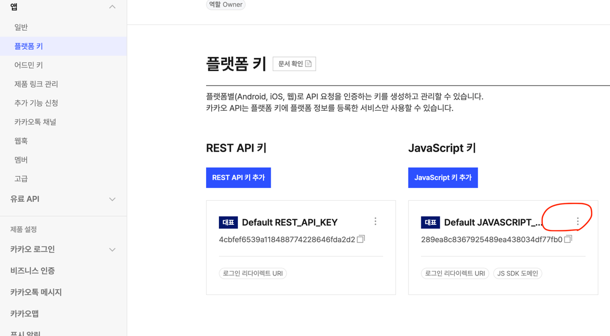
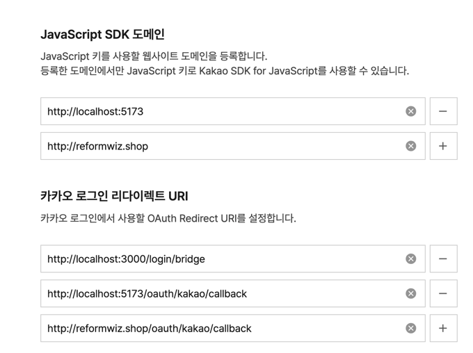

# 소셜로그인 가이드(예제는 카카오)
## [1. 필요한 셋팅하기]
- 
- 
- 
```
0. index.html에 카카오 sdk 삽입
a. Javascript키 더보기 클릭해 들어가기
b. 도메인, 리다이렉트 추가
c. RestAPI 키 쪽의 키값 저장해놓기
```

### [2. 소셜 로그인페이지, 브릿지 페이지 생성하기]
- KakaoLoginPage.jsx
- SocialBridgePage.jsx
```aiignore
흐름은 다음과 같다.
1. 로그인 페이지 > 카카오 버튼 클릭
2. KakaoLoginPage.jsx 내에 렌더링 시작 때 kakaoLoginForm 호출(Kakao 꺼의 페이지)
3. 카카오 로그인 이후 redirectUrl 설정해놓은 브릿지 페이지 이동
4. SocialBridgePage.jsx 도착하면 **인가코드** 로 access_token 발급(Rest API키 필요함)
5. access_token으로 계정 정보 조회하기
```

### [3. 테스트 진행해보기]
```aiignore
1. 로그인페이지 이동) http://localhost:5173/login
2. 카카오 버튼 클릭 > KakaoLoginPage.jsx로 이동
3. KakaoLoginPage.jsx 내에서 카카오로그인 폼 호출
4. 로그인 끝난 뒤 SocialBridgePage.jsx 페이지로 이동
5. 인가코드로 RestAPI 키와 함께 access_token 조회
6. access_token으로 카카오 계정정보조회
```

<b>추천: 인가코드만 프론트에서 발급받고 인가코드를 백엔드에 주어 처리하는 방식이 더 안전함</b>

